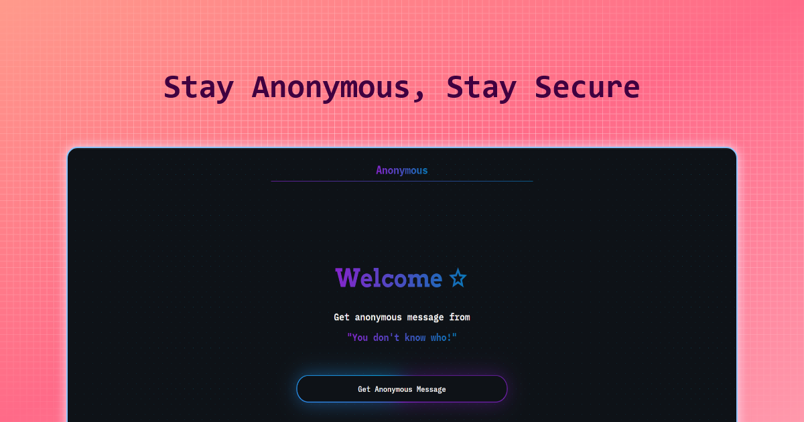

<h1 align="center" >
 Privacy Policy
</h1>

**_Last updated: December 31, 2024_**

Welcome to **Anonymous** ("the App"). This Privacy Policy outlines how we collect, use, and protect your personal information when you use our App. By using Anonymous, you agree to the practices described in this policy.

    

## 1. Information We Collect

At Anonymous, we prioritize your privacy. We only collect the following information:

- **Email Address**: Used for account creation and authentication.
- **Display Name**: For personalization and identifying users.
- **Profile Photo**: For improving the user experience and personalization.

We do **not** collect any device information or other personal data.

---

## 2. How We Use Your Information

The information we collect is used solely for the following purposes:

- To personalize your experience within the App.
- To ensure secure authentication and account access.
- To provide support and respond to user inquiries.

Your information is **never shared** with third parties for advertising or other purposes.

---

## 3. Data Security

We employ robust encryption and security measures to protect your data:

- **End-to-End Encryption**: All messages sent and received through the App are encrypted using industry-standard protocols, ensuring that only the intended recipients can read them.
- **Secure Storage**: User data, including email addresses, display names, and profile photos, is stored securely in our database with restricted access.
- **Access Control**: Only authorized personnel can access the database, and all access is logged and monitored.

Despite our efforts, no system can be completely secure. In the event of a data breach, we will notify affected users promptly and take appropriate steps to mitigate risks.

---

## 4. Public Codebase

To foster transparency and trust, the App's source code is publicly available. You can review the code to verify its functionality and ensure your data is handled as described. However, the implementation of the data handling system is kept private for security reasons.

---

## 5. Your Rights

As a user, you have the following rights:

- **Access and Update**: You can access your email address, display name, and profile photo at any time and update your username once every 30 days.
- **Account Deletion**: You can request to delete your account, and all associated data will be permanently removed from our servers.
- **Transparency**: You can request information about how your data is used and secured.

---

## 6. Changes to This Privacy Policy

We may update this Privacy Policy from time to time to reflect changes in our practices or legal requirements. Any updates will be posted on this page, and significant changes will be communicated to users directly.

---

## 7. Contact Us

If you have any questions or concerns about this Privacy Policy or your data, please contact us at:

**Email:** **cast.sahedul@gmail.com**

Thank you for trusting Anonymous. Your privacy and security are our top priorities.
