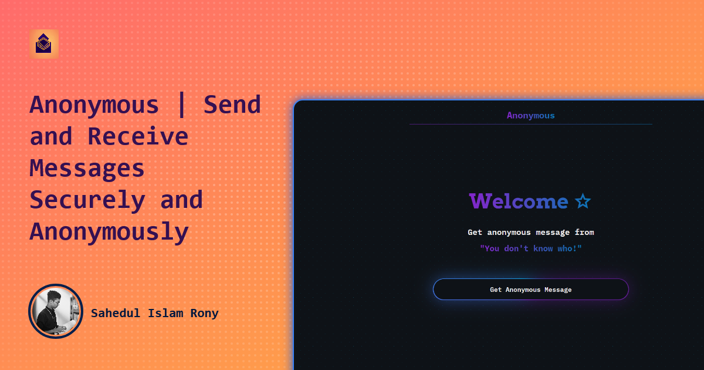

<h1 align="center" >
Anonymous
</h1>

**A sleek and innovative platform designed for anonymous message exchange with full control over your account and data. This app ensures user privacy and provides a unique user experience with its feature-rich functionality.**

    

## Features

- **Authentication:** Sign in with Google via Firebase Authentication.
- **Anonymous Instance:** Deploy and manage multiple instances of the application for different user groups or purposes.
- **Username Management:** Users can update their username once every 30 days.
- **Message Deletion:** Delete unwanted or inappropriate messages with ease.
- **Link Pause:** Pause the link to stop receiving messages temporarily.
- **Account Management:** Log out or permanently delete your account, including all associated data from the database.
- **Responsive & Unique UI:** A modern and user-friendly design to enhance user experience.
- **Routing:** Managed with React Router DOM for seamless navigation.
- **No App:** No need to install any app, everything is web-based.

## Under Development Features

1. **Anonymous Instance Creation:** Users can create anonymous instances using Firebase Authentication.
2. **In-App Replies:** Users can reply to messages within the app without needing Facebook or Instagram.
3. **Reply Viewing:** Senders can see replies without creating an account.
4. **Message Download:** Users can download specific messages in image format.

Sure! Here’s the revised version of the tech stack for your anonymous message-sending app:

---

## Tech Stack & Tools

 

 

- **React:** A library for building dynamic user interfaces.
- **JavaScript:** The programming language used for the app's functionality.
- **Redux:** A state management tool for handling application data.
- **React Router:** A library for managing navigation and routing within the app.
- **CSS & SCSS:** Used for styling the app’s interface and creating a responsive design.
- **Firebase:** A platform for backend services, used for user authentication and real-time database management.
- **Vite:** A build tool for faster development and optimized production builds.
- **Git:** A version control system for managing code changes and collaboration.
- **GitHub:** A platform for hosting and sharing the project’s code repository.
- **Visual Studio Code:** A powerful code editor for writing and managing the app's code.

## Express your Thoughts ✨
🎉 **Send me a message** : **[@sahed](https://getmsg.netlify.app/sahed)** 😍

## Demo

## Other Documentations

- [**Author**](Author.md) - Information about the author of the project.
- [**Privacy Policy**](Privacy-policy.md) - Details about the privacy policy of the application.
- [**Terms of Use**](Terms-of-service.md) - Terms and conditions for using the application.

  <!-- GitAds-Verify: XT5IGKJHVE42AYB7J17BDRT6X7FLZR5H -->
